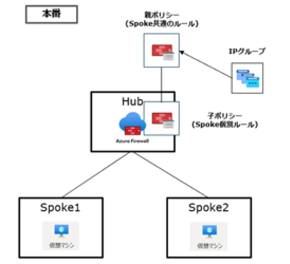
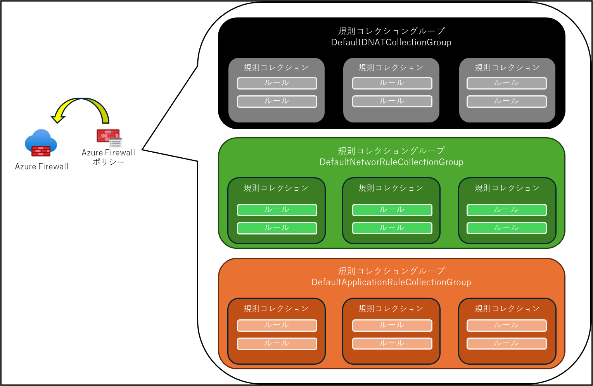
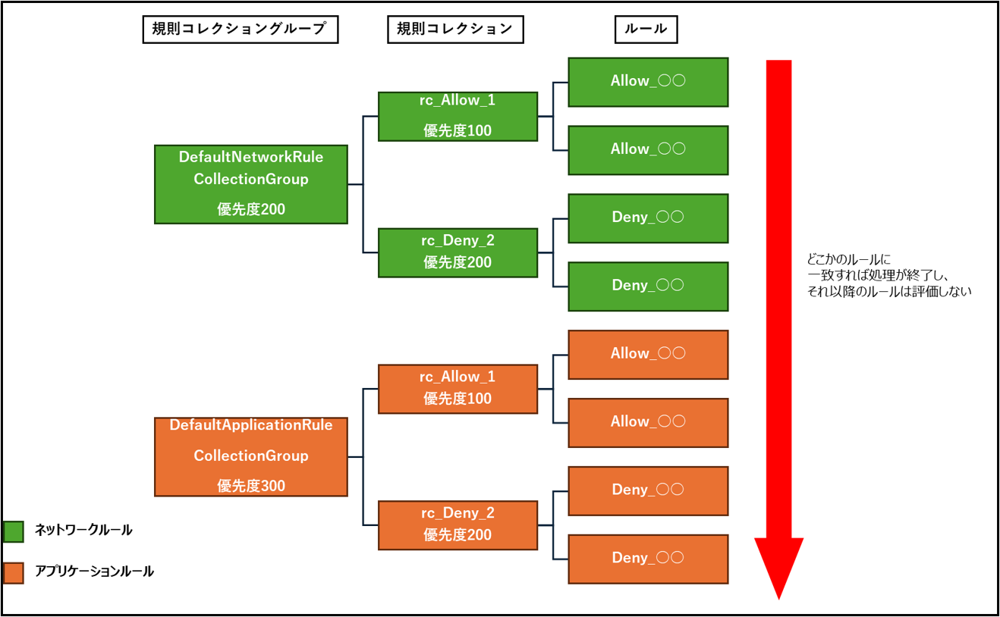
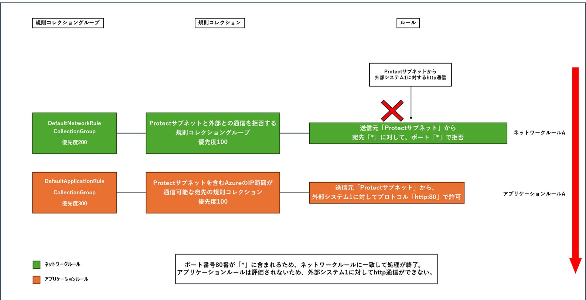
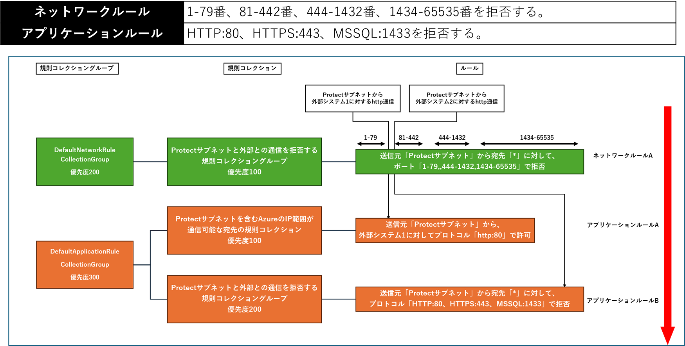
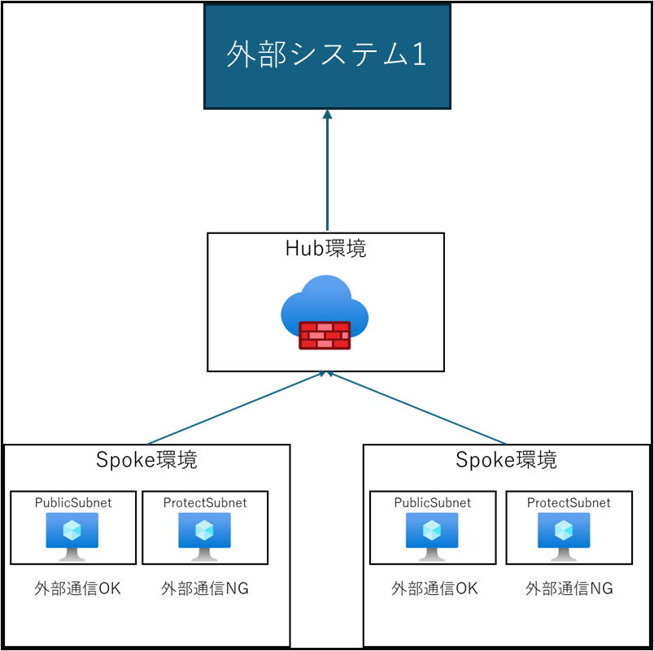
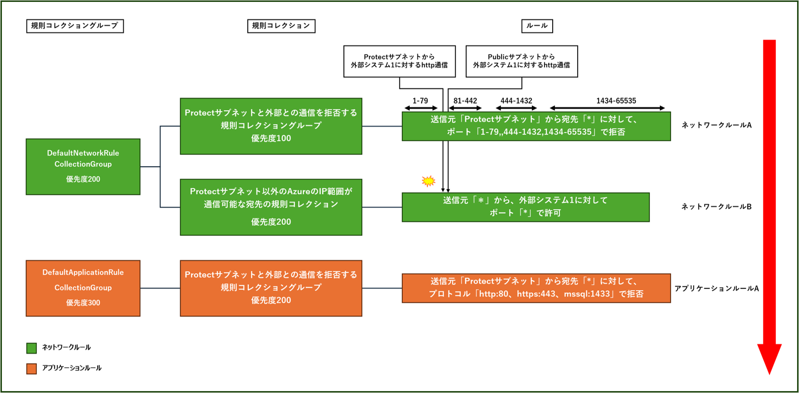
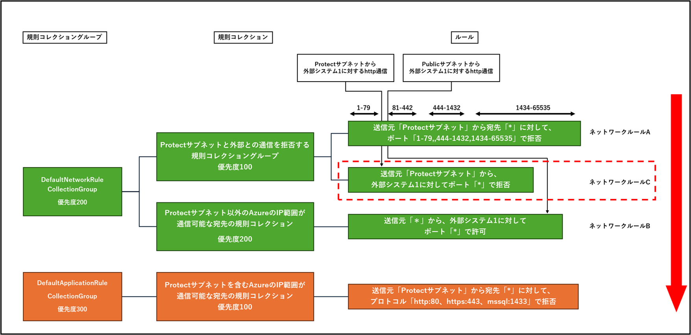

# AzureFirewallとは

## AzureFirewallとは

- Microsoftが、Azure上で提供するファイアウォールサービス（PaaS）
    - 仮想ネットワークに、専用サブネット(AzureFirewallSubnet)が必要
- 高可用性
    - ロードバランサーが不要
    - 複数のゾーン(データセンター)に対してデプロイ可能
- フィルタリング
    - アプリケーション ルール: アクセスできる完全修飾ドメイン名 (FQDN) を定義します。
    - ネットワーク ルール: 送信元アドレス、プロトコル、宛先ポート、送信先アドレスを定義します。
    - サブネットへの受信インターネット トラフィックを変換およびフィルター処理するための DNAT ルール。

## SKU（機能グレード・プラン）の違い

 - Basic
    - 中小企業向けのプラン
    - 推定スループットが 250 Mbps の環境に推奨
    - 脅威インテリジェンスはアラートのみで、ブロックまではしない
    - ネットワークルールでは、FQDNでフィルタリング不可
- Standard
    - 最大30Gbpsのスループットを推定
    - フィルタリングにWeb カテゴリが追加され、FQDNベースでカテゴリを識別
    - ネットワークルールでは、FQDNでフィルタリング可
- Premium
    - 支払い業界や医療業界など、機密性の高い規制された環境に適した高度な脅威保護を提供
    - TLS 検査
    - IDPS (侵入検出および防止システム)
    - パフォーマンス：最大 100 Gbps までスケールアップ
    - Webカテゴリのフィルタリングで、FQDN または URL のカテゴリを識別する

## フィルタリング機能

### リソース構成

- AzureFirewall
    - ファイアウォール機能を提供するAzureの マネージドサービス本体
- AzureFirewallポリシー
    - そのAzure Firewallの設定 （ネットワークルール、アプリケーションルール、DNAT、脅威インテリジェンスなど）を定義し
    - 複数のファイアウォールインスタンスやリージョンにまたがって一元管理する。
    - 別のAzureFirewallPolicyを親として関連付けることで、さらに高位の優先度のルールを作ることができる。

ルールの設定は、AzureFirewallポリシーに行うので、AzureFirewallポリシー自体にルールは設定しない

### Firewallポリシーのルールに関する設定項目

- ルール
    - 宛先に対する通信の許可、または拒否を行うための条件を定義
    - 優先度やルールの区分は指定できない
- 規則コレクション
    - ルールの管理単位。
    - ネットワークルール(L3,L4)・アプリケーションルール(L7)の区分「許可,拒否」の区分、および優先度はここで決める
- 規則コレクショングループ
    - 規則コレクションをさらにグルーピングするための、最大の管理単位
    - デフォルトで存在するグループ 
    「DefaultNetworRuleCollectionGroup」、「DefaultApplicationRuleCollectionGroup」、「DefaultDNATCollectionGroup」 
    ※任意の名前で作成することは可能

### 基本的な処理動作

- 既定ではすべて拒否
    - 明示的に許可、拒否をしない場合、通信が拒否される 
    ※ルールが見つからないとしての拒否のため、明示的な拒否とは少し違う
- 優先度順の評価
    - 規則コレクショングループ　＞　規則コレクション　の優先度順に評価
- ルールの種別による処理順序
    - DNAT ルール→ネットワークルール→アプリケーションルールの順に処理 →　上記の優先度に関係なく、この順は変えることができない →　規則コレクショングループが規定値で存在するのはこれに準じるため
    - ルールの一致が見つかった時点で、評価が終了する

## ネットワークルールとアプリケーションルールの設計のポイント

### ネットワークルールとアプリケーションルールの使い分け

- アプリケーションルール
    - HTTP,HTTPS,MSSQL(データベース通信)の通信
    - かつFQDNで宛先を制御できる場合
- ネットワークルール
    - IPアドレスで宛先を制御する場合
    - または通信プロトコルをHTTP,HTTPS,MSSQL以外で制御する必要がある場合

### ネットワークルールで広範囲で拒否する場合

- アプリケーションルールの評価に干渉しないようにする
- http,https,MSSQLのプロトコルはアプリケーションルールで拒否
- それ以外はネットワークルールで拒否する

### 例1:Hub & Spoke環境で　アウトバウンド通信をHub経由にした例

Spokeからのすべての通信は、Hub環境のAzureFirewallをネクストホップするようにルーティング。 
Protectサブネットは、外部通信がNGであるとするが、外部システム1(fqdnあり)へのhttp通信については例外的に許可する 
これを実現する方法は？

**問題：ネットワークでhttp通信を拒否すると、アプリケーションルールの許可に届かない**

**対策：ルールごとに拒否するポートを分ける**

### 例2:Hub & Spoke環境で　アウトバウンド通信をHub経由にした例

Spokeからのすべての通信は、Hub環境のAzureFirewallをネクストホップするようにルーティング。

Protectサブネットは、外部通信がNGであるとする。 
例1とは違い、外部システム1へのhttp通信もNG

外部システム1はFQDNで制御できず、IPアドレスで指定する 
※ネットワークルールで許可ルールを設定する必要がある

Protectサブネットは拒否し、Publicサブネットは外部システム1に対してhttp通信を許可するには？

**問題：送信元「*」で外部システム1の通信を許可すると、Protectサブネットもhttp通信が許可されてしまう**

**対策：許可したルールに応じて拒否ルールを設定する**

## まとめ

- 必要な箇所だけ穴あけすることが理想 
  →　AzureFirewallの設計思想が、ホワイトリスト方式である
- 広範囲に許可する一方、一部のセグメントで拒否する場合
- 広範囲な設定が、アプリケーションルールに干渉していないか考慮する
- 実際に特定のセグメントが拒否できているか、しっかり検証することが重要

